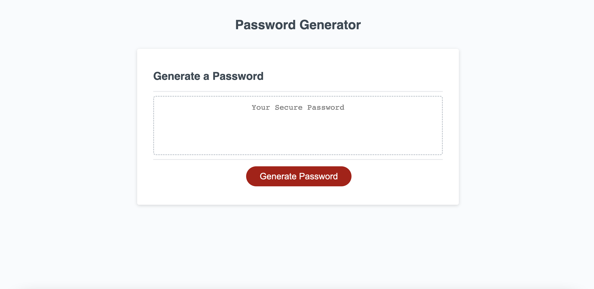

## Project Title

Isabel's Password Generator

## Project Description

This application is a password generator that outputs randomised passwords based on criteria selected by the user. Optional criteria include password length between 8-128 characters, and use of lowercase, uppercase, numeric and special characters. Using JavaScript, the application will supply a unique password each time these criteria are selected. HTML and CSS used for a simple base of the page.

## Mock-Up

The following image shows the web application's appearance and functionality:

## Credits

Application based off Starter Code provided by Monash Coding Bootcamps. 

## Installation & Links

Deployed Application: [isabelkvaughan.github.io/password-generator-isabel/](https://isabelkvaughan.github.io/password-generator-isabel/)

GitHub Repository: [github.com/isabelkvaughan/password-generator-isabel/](https://github.com/isabelkvaughan/password-generator-isabel/)

GitHub profile: [github.com/isabelkvaughan](https://github.com/isabelkvaughan)

## Contact

Isabel Vaughan 
https://www.linkedin.com/in/isabel-vaughan-b68984bb/